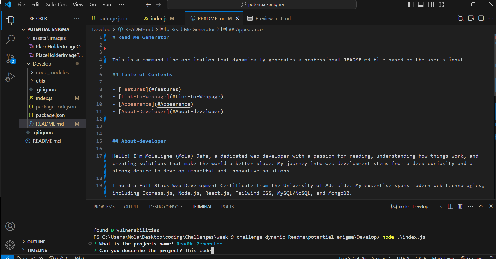

# Read Me Generator

This is a command-line application that dynamically generates a professional README.md file based on the user's input.

## Table of Contents

- [Features](#features)
- [Link-to-Webpage](#Link-to-Webpage)
- [Appearance](#Appearance)
- [About-Developer](#About-developer)
- 

## About-developer

Hello! I'm Molaligne (Mola) Dafa, a dedicated web developer with a passion for reading, understanding how things work, and creating solutions that make the world a better place. My journey into web development stems from a deep curiosity and a strong desire to develop impactful and innovative solutions.

I hold a Full Stack Web Development Certificate from the University of Adelaide. My expertise spans modern web technologies, including Express.js, Node.js, React.js, Tailwind CSS, MySQL/NoSQL, and MongoDB.

## Features

- Dynamic Title creation
- Dynamic Image selection

  
 
  
## Link-to-Webpage
- https://github.com/Mola90/dynamic-Readme-Generator

## Appearance

The following image demonstrates a image of the program running
